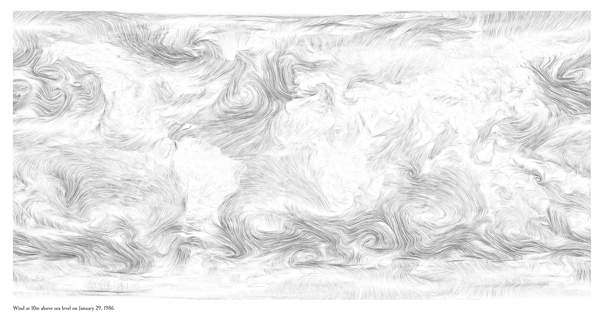
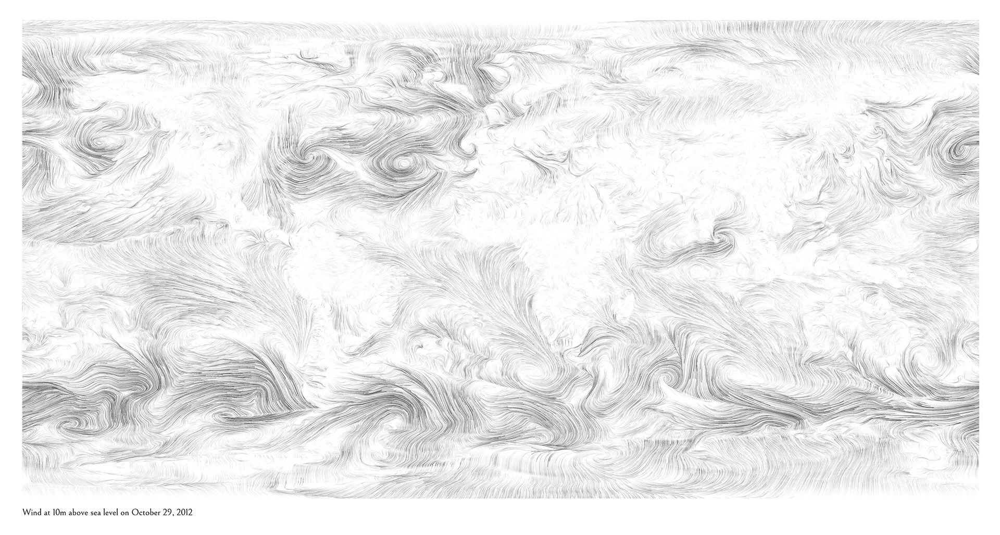
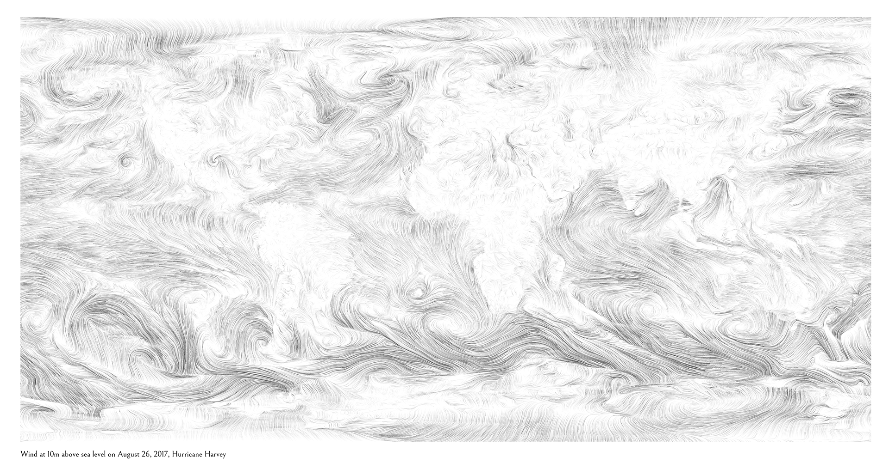

# Custom historical wind maps

A simple script that grabs wind data from 10 meters above sea level any day/time from January 1, 1979 to about three days ago and outputs a high resolution global wind map in a black-and-white, pencil-drawn style suitable for printing.

## Samples

My birthday (1/29/1986):



Hurricane Sandy (10/29/2012):



Hurricane Harvey (8/26/2017):



## Requirements

- [Python](https://www.python.org/)
- [pygrib](https://github.com/jswhit/pygrib) - for reading GRIB files, also requires [ecCodes](https://confluence.ecmwf.int//display/ECC/ecCodes+Home) or equivalent
- [Python Pillow](https://pillow.readthedocs.io/en/5.3.x/) - for image processing and output
- [PyOpenCL](https://mathema.tician.de/software/pyopencl/) - for efficient data processing by taking advantage of graphics card
- [curl](https://curl.haxx.se/) - for downloading files from internet (alternatively, you can manually download files to ./downloads/ folder)

## Data sources

All data is publicly available from [NOAA's National Centers for Environmental Information](https://www.ncdc.noaa.gov/). It comes from three different datasets depending on the date:

- Dates from Jan 1, 1979 to Mar 31, 2011
   - [NCEP Climate Forecast System Reanalysis (CFSR) - Time series](https://www.ncdc.noaa.gov/data-access/model-data/model-datasets/climate-forecast-system-version2-cfsv2#CFS%20Reanalysis%20(CFSR))
   - Data resolution: 1760 x 880
- Dates from Apr 1, 2011 to 6 months ago
   - [CFSv2 Operational Analysis - Time series](https://www.ncdc.noaa.gov/data-access/model-data/model-datasets/climate-forecast-system-version2-cfsv2#CFSv2%20Operational%20Analysis)
   - Data resolution: 1760 x 880
- Dates from 6 months ago to about 3 days ago
   - [Global Forecast System (GFS)](https://www.ncdc.noaa.gov/data-access/model-data/model-datasets/global-forcast-system-gfs)
   - Data resolution: 720 x 361

## Running script

### Basic usage

The following an image using highres data for January 1, 1979 at noon. You can choose any date after 1/1/1979 up until about three days ago. Valid hours are 00, 06, 12, 18 (every 6 hours starting at midnight). The data is rather large (sometimes > 1GB of data) so may take a little while for slow internet connections or older computers.

```
python run.py -date " 1979-01-01-12"
```

## Custom size

The following creates an image that is 17 x 11in with a 1 inch margin (image will be vertically centered) at 150dpi

```
python run.py -width 17 -height 11 -margin 1 -dpi 150
```

## Custom styles

You can change the number of wind lines

```
python run.py -particles 100000
```

Or the length of the wind lines

```
python run.py -ppp 500
```

Or overall line brightness

```
python run.py -brightness 0.5
```

## Custom labels

```
python run.py -label "My custom label"
```

To see all the possible parameters:

```
python run.py -h
```
